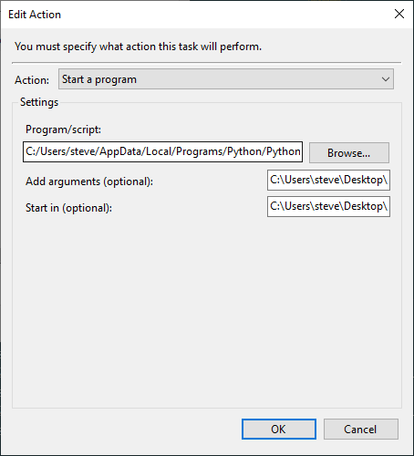

## PYTHON SCRIPT TO AUTOMATICALLY CHANGE YOUR WALLPAPER EVERY 30MINS

## Getting Started:
1. Clone the repo:
    ```
    git clone https:\\github.com\chidubesteve\wallpaper_changer
    ```

2. Install the required dependencies by running the following command in your terminal or command prompt:

    ```bash
    pip install -r requirements.txt
    ```

## Usage:


1. Run the script on your local machine. This script fetches wallpapers from Reddit and sets them as your desktop background.

    ```bash
    python wallpaper_changer.py
    ```

2. The script will run indefinitely, changing your wallpaper every 30 minutes. To make it run when you startup your system:
- rename the python file to `wallpaper_changer.pyw` . This means the file creates no window.
- create a shortcut of the file
- Press Windows key + R and type ```shell:startup```
- Drag and drop the shortcut file into the new explorer window


### Note:

- Make sure you have Python installed on your system.

- If you encounter any issues, check the script for proper file paths and internet connectivity.

- The script uses the `requests` library for fetching data from Reddit. If not already installed, it will be automatically installed when running the `pip install` command.

- try printing the response and if you get an error that says `{"message": "Too Many Requests", "error": 429}` then, you can solve this by supplying  a user agent in the header. this [site](https://www.whatismybrowser.com/guides/the-latest-user-agent/) provides info about the latest user agent for your browser. Refactor your code to include the header in your request like so 
```bash
myHeader = {
    "User-Agent": "Mozilla/5.0 (Windows NT 10.0; Win64; x64) AppleWebKit/537.36 (KHTML, like Gecko) Chrome/90.0.4430.85 Safari/537.36"
}
# MAKE SURE TO CHECK THE WEBSITE FOR THE LATEST INFO FOR YOUR BROWSER AND USER AGENT
textData = requests.get('https://www.reddit.com/r/wallpaper/new.json', headers=myHeader).content
```

- You need to adjust `%FILE_DESTIONATION_YOU_WANT_TO_STORE_THE_IMAGE%` in the script to match your system's directory structure.

- If you're using UNIX/LINUX check through this [stackoverflow](https://stackoverflow.com/questions/1977694/how-can-i-change-my-desktop-background-with-python) thread for the right library to use to store it on your disk as the `ctypes` module is for Windows user.

## EDIT:

- I realised that the above steps only changes the wallpaper on your system startup and it doesn't refresh unless the code is ran again.

#### Below are the steps to take to make the script run recursively daily

1. on the start bar, type **Task scheduler** and open the app


follow this [guide](https://levelup.gitconnected.com/automate-your-python-scripts-using-windows-task-scheduler-without-a-cmd-pop-up-dec46466fdfe) on how to create a task

#### under "Action tab"
- in the "Program/script" field; fill in the path to the no gui python script. to find it 
open the command prompt and run

    `where python`
mine looks like this => `C:/Users/steve/AppData/Local/Programs/Python/Python312/python.exe`.
copy it and before the *.exe* extension add a *w*
- in the **Add arguments(optional)** field add the path to your windowless python script `C:/Users/steve/Desktop/Programming/Wallpaper_changer/wallpaper_changer.pyw`

- include the path to the current folder of this project to the **start in(optional)** field => `C:/Users/steve/Desktop/Programming/Wallpaper_changer` and click ok

you can also check this stack overflow [thread](https://stackoverflow.com/questions/1689015/run-python-script-without-windows-console-appearing)


final window should look like this 

*Voila* you have succeeded in scheduling the recurrent execution of your wallpaper-changing script without displaying the command prompt.

⭐ the repo if you found this helpful
### Happy wallpaper changing!


